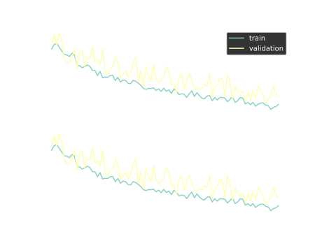
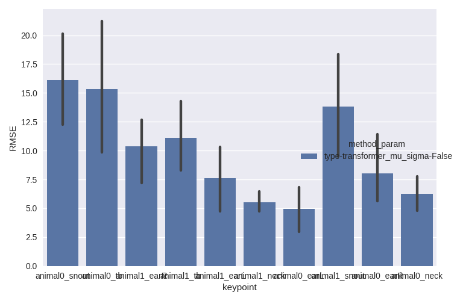

# Frequently Asked Questions
## Questions about the parameters and general graphs
**Author: France ROSE. Thanks to the questions of Timon Blindauer**

## Create dataset

### What does **subsampling frequency** do?

The subsampling frequency parameter is used to reduce the frequency, or the number of samples taken from the original data to a lower rate. So, reducing subsampling freq. for example from the original of 25 Hz to 10 Hz results in a freq. of 10 Hz in the end.      
In other words, if the original data is at 25 Hz, you have 25 values for a second, if you reduce the frequency to 10 Hz, you will encode the same information of 1 second in 10 timepoints. In the code, it is done by averaging the original values.
If you do not want subsampling, put subsampling_freq the same number as the original_freq.

### What is the **length** parameter?

The length will be the sample length in the subsampling_freq as an integer (number of timeframes).
E.g. at 25 Hz, 50 points would represent 2 seconds. 
The actual choice of the subsampling frequency and the length is left to the user. There is no right or wrong choices, it depends on the experiment and how much data we have. The idea of the dataset creation is to chunk the original files in smaller parts, the smaller parts would be of length sample_length.

### What should I put for the **stride** parameter?

Stride refers to how many frames are skipped between successive samples frames during video processing or analysis. Stride determines is inversely proportionate to the amount of overlap or gap between consecutive samples or frames when subsampling chunking the original data into samples. Stride in our context is just used to reduce computational requirements or does it have any other use besides that? It is to increase (or decrease) the number of available training samples. If the original data is large (2,000 samples in the 'w-0-nans' training dataset), then `stride = sample_length` or `stride = sample_length / 2` is a good idea. If to start with the original data is small (< 1,000 samples in the 'w-0-nans' training dataset), then reducing the stride creates more samples (that are a bit redundant but still better than not enough samples).

### What are **discard_beginning** and **discard_end** used for?

They can be used to discard frames/timepoints at the beginning and end of the dataset.
Sometimes, the beginning and/or the end of recordings are not “clean” enough should not be used to create samples.
To not use this option, put 0 and -1 respectively. 

### What is **fill_gap** option? I thought the whole point if DISK was to fill gaps!

If fill_gap has a value > 0, linear interpolation will be used to fill gaps in the dataset which are smaller or equal to the provided number (e.g. 1, 2 and 5 could be possible values). 
It can be used in the case where the dataset created without this has very few samples. And it has been shown that for very short gaps, linear interpolation would do a good job. The maximum value fill_gap can take and still have a good interpolation depends on the frequency (higher frequency = not much change between 2-3-...-10 timepoints so it’s ok to just draw a line between them) and the movements that are recorded (fast / slow movements – depends on the animal and on the behavior task).

### What does **sequential** option do?

There could be 2 scenarios for the input data when creating a dataset:
1. many individual recordings,
2. only a few long recordings.

**Scenario 1.**

We put full recordings either in the train, test, or validation sets. In other words, all samples from one recording will belong to either one of the sets.

**Scenario 2.**

Because there aren’t many files to begin with, it is hard / impossible to apply the same strategy as scenario 1. Instead, I split the file into 3 parts sequentially:
- the first 70% of each file is split into samples and put in the train dataset (so from t=0 to t=0.7*total_length)
- the following 15% of each file is split into samples and put in the test dataset (from t=0.7*total_length to t=0.85*total_length)
- the last 15% of each file is split into samples and put in the validation dataset (from t=0.85*total_length to t=total_length)

## Training models

### What value should I put for *batch_size*?

Batch size is a term refering to Deep Learning training. It is used in the context of mini-batch optimization. 
The definition of batch size is how many samples will be loaded to the GPU memory and processed at once by the network, and usually the backward propagation is run every (mini)-batch.
There are 2 considerations: 
1. how many samples can fit in the GPU memory knowing that the network weights are already stored there, 
2. for some networks like transformers the batch size can affect the learning process itself and can lead to better or worse performance at the end of the training.

To be clear, it is not so much about the number of timepoints – this is fixed when creating the dataset (let's take 50 for an example) – but about the number of samples. A sample will be 50 timepoints x number of keypoints x 2D or 3D. How many samples constitute a batch will be given by the batch_size value.

### Should I change something about loss and model_scheduler hyperparameters?

Unless you are familiar with DL recipes, we advise not to touch to loss and model_scheduler hyperparameters.

### What is the difference between *Normalize* and *NormalizeCube*, and what should they be set to?

In general, normalization is used to scale the data to a standard range in order to prevent singular datapoints to dominate the learning process.
Both *Normalize* and *NormalizeCube* correspond to a min-max scaling for the entire sequence (e.g., 50 timepoints) and all the keypoints considered together. The different between “Normalize” and “NormalizeCube” is that in “Normalize” the min and max are calculated per dimension, so they would be different for the X axis and for the Y axis (and eventually for the Z axis). In “NormalizeCube” the min and max are the same for all axes, which will make sure that in the normalized space a distance d in X axis will be the same in Y axis. This last property is not true in the case of “Normalize”. It will not have a big effect on skeleton like mouse but can have for a human or a fish because they are more elongated in one direction than in another.

### What is the *verbose* option doing? Even set at 0 it prints the losses at given epochs.

Yes, the verbose option affects the data preprocessing part, and not the learning part. Raising it to 1 or 2 will output more plots, it is in priority used for debugging data generation and transforms. If you are starting to use DISK, we recommend you to keep it to 0.

### How to know the model has trained successfully?

Here is an example of a successful training with an L1 loss. Both the training and the validation losses decrease with a small difference between them.

When `mu_sigma=True`, the used loss is NLL (Non-Negative Likelihood) and the training loss plot looks different. 
See above a successful training of a transformer with `mu_sigma=True`, the loss increases but the RMSE (our reference metric) decreases.

Here the loss is not decreasing much and the validation RMSE varies a lot. The trained models are probably not satisfactory (to confirm with test plots). Try increasing dataset size.

Possible problems during training:
- NaNs (not a number) in the loss or RMSE (on the loss plot it will create holes in the curve line). This is a bug with the code or dataset. Contact us!
- loss is decreasing but not enough, this would be confirmed by the test plots (RMSE comparable to linear interpolation or unsatisfactory imputation for the example plots). Try training for longer.
- training loss decreases but not the validation loss or the two curves are separated by a big gap, it is a case of overfitting. Probably your dataset is not big enough. Go back to dataset creation and implement some of the described tricks. 

## Testing models

Azim: controls the azimuthal or horizontal viewing angle of the plot
Yes for the 3D skeleton plot, which is only available when a skeleton file is input.

### What is *only_holes* in this context ?

`only_holes = True` will only display the imputation in the visualize_validation plots of the missing data. When `False` the network output with the whole sequence and all keypoints will be plot as well.

### And what is the *original_coordinates* option?

The RMSE and the plots are done on the normalized coordinates if `original_coordinates = False`. It helps compare sequences, and different datasets because then the error is roughly proportionate to the skeleton size. With `original_coordinates = True` it will convert it back to the original coordinates (mm or cm depending on the dataset) so conclusions such as "on average the model is making a 0.2mm error" can be drawn.

### In the following plot, why isn't the transformer model compared with linear interpolation?

The comparison with linear interpolation is only possible when there is at least one non-missing keypoint before the hole and after the hole. If the padding parameter in the test config file is [1, 0] then linear interpolation cannot be computed for every hole and is not displayed. To compare the network‘s output with linear interpolation the padding parameter should be at least [1, 1]

With this plot, you can compare how the model is doing on different keypoints. You could also compare more than one model when listing more than one folder under `checkpoints` in the config file.
