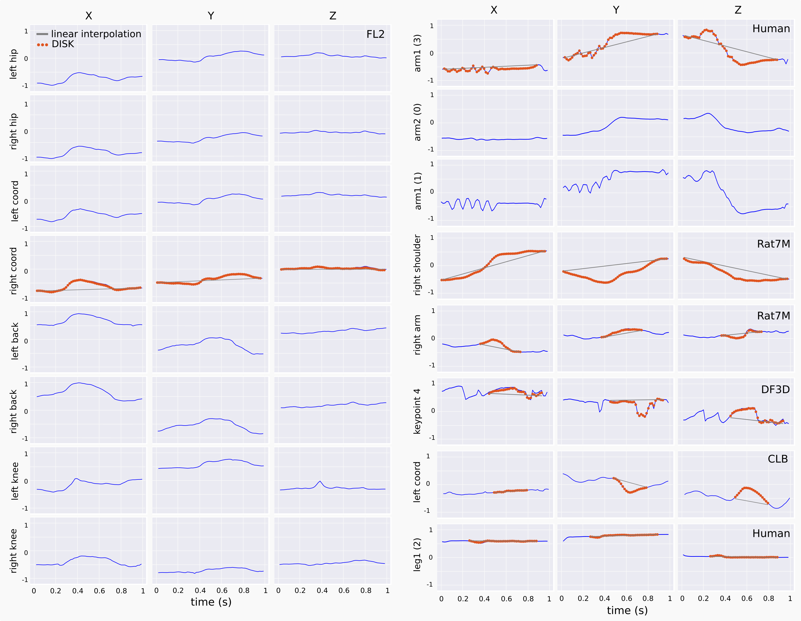
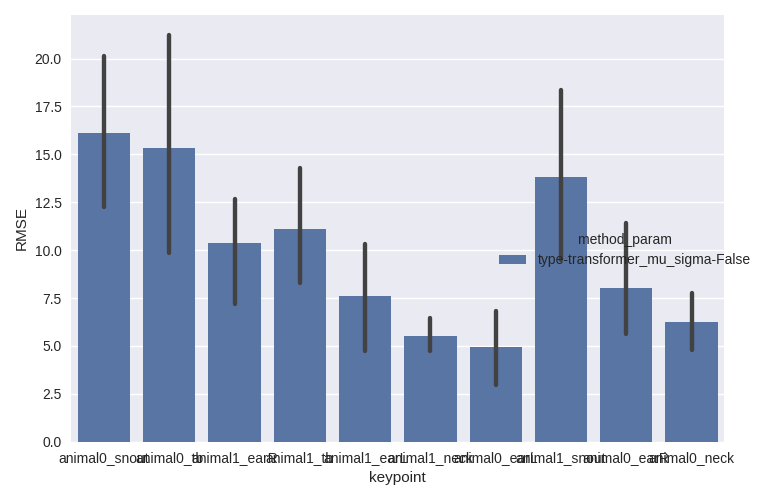

# DISK (Deep Imputation of SKeleton data)
Neural network method to impute missing values for 3D skeleton data.

Example of imputations: blue lines are the original signal, red dots represent the imputation done by a transformer model, and the gray line the linear interpolation.
DISK is able to learn correlations between keypoints and dynamics from the training data to fill gaps on a much longer horizon than linear interpolation.
DISK allows to use a bigger proportion of experimental data for downstream behavior analysis.

## Table of Contents

- [Description](#description)
  - [Practical aspects](#practical-aspects)
    - [Configuration files and script launching](#configuration-files-and-script-launching)
    - [Neural network training](#neural-network-training)
- [Installation](#installation)
- [First steps tutorial (google colab notebook)](https://drive.google.com/file/d/1ycrxt3r9BP6b8N9LYGQ-4y3mdS5ebRGD/view?usp=sharing)
- [Detailed usage](#detailed-usage)
  - [Step 0. File organization](#step-0-file-organization)
  - [Step 1. Use an already created dataset or create your training dataset from your own data](#step-1-use-an-already-created-dataset-or-create-your-training-dataset-from-your-own-data)
  - [Step 2. Train a model](#step-2-train-a-model)
  - [Step 3. Test trained models](#step-3-test-trained-models)
  - [Step 4. Impute the dataset](#step-4-impute-the-dataset)
- [Frequently Asked Questions](FAQ.md)
- [How to cite us](#cite-us)

----

# Description

This code allows to train in an unsupervised way a neural network to learn imputation of missing values.
Skeleton data are data points corresponding to body parts recorded through time. This code focuses on 3D data.


Several network backbones are implemented:
- Temporal Convolutional Neural Network (TCN), 
- Spatial-Temporal Graph Convolutional Network (ST_GCN), 
- Separable Time-Space Graph Convolutional Network (STS_GCN),
- Bidirectional Gated Recurrent Unit (GRU) -- 2nd best performance and shorter to train,
- **Custom Transformer Encoder** (transformer)  -- best performance.

These networks have been tested on different animal skeletons and human skeleton (see Datasets section).


The training is done on data with artificially introduced gaps. This process of introducing gaps is controlled by 3 files: 
- the probability of a given keypoint to be missing
- the probability of a given gap length knowing the missing keypoint
- the number of missing keypoints in a given sample.

These 3 files can be customized, and can contain the estimated missing probabilities computed on the original data. These files can also be designed to train with an uniform probability.


## Practical aspects

### Configuration files and script launching

This repo uses configuration files via the hydra package. 
Maybe not intuitive at the beginning it offers several advantages:
- all the parameters and input values are visible at once in one file and can be changed by the user
- hydra package takes care of logging and saving the configuration file for each run allowing to keep track and boost reproducibility

There are 3 main scripts and their respective configuration files:
- `main_fillmissing.py` and `conf/conf_missing.yaml` to train the neural network
- `test_fillmissing.py` and `conf/conf_test.yaml` to test the neural network on artificially introduced gaps with a test RMSE and plots to check the quality of the model
- `impute_dataset.py` and `conf/conf_impute.yaml` to use the trained model to impute real missing gaps in the data

To launch the scripts, 
- you need to open the respective configuration file and change the appropriate fields according to your goal,
- then call the script `python main_fillmissing.py`, which will read all the options and parameters set in the partner configuration file.

**NB**: Because hydra is managing the logging, it is important to not copy/cut a trained model without the hidden 
folder `.hydra/` saved in the same location. In particular, the training config file saved by hydra along the trained 
model would be used to load the model when using the model for test or imputation.

### Neural network training

We advise to run the training (`main_fillmissing`) on a machine with a GPU.

Transformer model has the best performance for all the tested datasets.
However transformer usually benefits from a lower batch size (32 or 64) and is the slowest to train even on GPU.
Depending on the size of the training dataset, it can take a few hours to days. 

GRU is the second best model in terms of performances. 
GRU can be trained with larger batch size (up to 512 if enough GPU memory) and is shorter to train. 
It can still take hours to train on a middle sized dataset.

# Installation

If using [conda](https://docs.conda.io/projects/conda/en/latest/user-guide/install/index.html)/pip, you can first create a new environment:
```bash
# if using conda environments
conda create --name env_impute python=3.9 # requires python>=3.8,<3.10
conda activate env_impute
```

In all cases, installation from source can be achieved by the following commands:
- if using GPU (highly recommended for training)
```bash
git clone https://github.com/bozeklab/DISK.git
cd DISK
pip install -r DISK/requirements.txt -e .
```
- if using CPU only
```bash
git clone https://github.com/bozeklab/DISK.git
cd DISK
pip install -r DISK/requirements_cpu.txt -e .
```
This step should take up to 15-30 minutes.

**[VERY IMPORTANT - if using with GPU]** To test that pytorch is seeing the GPU, you can test it in python:
```python
# inside python interpreter
import torch
torch.cuda.is_available()
# should return True
```

For all cases, test if DISK is installed correctly. In Python, run:
```python
import DISK
# should run without returning anything
```

## Python troubleshooting

If you have trouble installing Pytorch, check [this page](https://pytorch.org/get-started/previous-versions/) for pytorch version `1.9.1` and your system.
You can install separately pytorch as a first step using for example `conda install pytorch==1.9.1 cudatoolkit=11.1 -c pytorch -c conda-forge` or `conda install pytorch==1.9.1 torchvision==0.10.1 torchaudio==0.9.1 cpuonly -c pytorch` for the CPU-only version.
For OSX, `conda install pytorch==1.9.1 torchvision==0.10.1 torchaudio==0.9.1 -c pytorch` or `pip install torch==1.9.1 torchvision==0.10.1 torchaudio==0.9.1`. 

# Detailed usage

## Step 0. File organization 

All the created files will be saved inside the working directory, however we recommend to not save them where the code is but rather in a different folder, for example `results`. To do this, you can launch the script while being in the `results` folder and use the argument `hydra.job.chdir=True`

```
results
  |
  |_ datasets
     |_ dataset_0_freqX_lengthY
         |_ train_dataset.npz
         |_ train_fulllength_dataset.npz
         |_ test_dataset.npz
         |_ test_fulllength_dataset.npz
         |_ val_dataset.npz
         |_ val_fulllength_dataset.npz
         |_ constants.py
         |_ dataset0_freqX_lengthY_proba_missing.csv
         |_ dataset0_freqX_lengthY_proba_missing_length.csv
         |
     |_ dataset_1_freqV_lengthW
         |_ ...
         |
     |_ ...
     |_ proba_n_mising_4.txt
     |
  |_ outputs
```

- In the `datasets` folder will be stored each dataset as a folder, e.g.  `dataset_0_freqX_lengthY`. 
In this folder `dataset_0_freqX_lengthY`, the dataset files per se (npz files) and the company files like the one with the dataset constants which will be read when using the dataset (`constants.py`).

- In the `datasets` folder will also be stored the files to create the artificial holes, the files with proba_missing in their names (See *Step 2.* below). 

## Step 1. Use an already created dataset or create your training dataset from your own data

This step will prepare the files to input to the neural network. 
It will prepare the cropped samples without missing data, save the necessary data and metadata in a convenient format.

We will use 2 scripts for this step: 
1. `create_dataset.py` and its companion config file `conf/conf_create_dataset.yaml`,
2. `create_proba_missing_files.py` and its companion config file `conf/conf_proba_missing_files.yaml`.

### Step 1.1 Create your own training - testing datasets

In the `conf/conf_create_dataset.yaml`, you should write:
- a list of input files to create the dataset from. The accepted formats are:
    - `.h5` files from SLEAP (cf documentation),
    - `.h5` and `.csv` from DeepLabCut,
    - `.csv` files with columns as keypoints coordinates, e.g. 'kp1_x', 'kp1_y', 'kp1_z', 'kp2_x', ..., 
    - `.npy` files where only the data are loaded, the keypoints would be named '01', '02', ...,
    - `.mat` files
    - other types of formats can be accomodated when a proper opening function is inserted in the function `open_and_extract` from the script `create_dataset.py`
- the **name of the dataset** (it will become the name of the folder)
- the **original frequency** (and if wanted the downsampled frequency)
- the **length** of the sequences wanted for the imputation.
- the **stride** (for a first try, can be equal to the length or to the length/2). This can be adapted: if not so much data, then decrease the stride to augment the size of the traning dataset; if lots of data, then it can be increased to reduce the dataset size and speeding the training.

**Not long enough segments Error**

If `ValueError, no data for ... with ... NaNs, probably due to not long enough segments`, it means the program has not found segments without any missing data of sufficient length. 
Workarounds are: 
- decreasing the **length**, 
- do a step of linear imputation before to fill the very small gaps with **fill_gaps**, 
- and/or **drop** one or several **keypoints** (the ones with the less good tracking).
The length, fill_gaps, and drop_keypoints are options in the config file.

**Too small dataset**

Additionally if there is enough segments but the resulting datasets have very few training samples (under 1,000) or test/validation samples (under 10).
You can further decrease the **stride** which will be create more samples by overlapping them.

On the contrary if the dataset is very large (over 20,000 samples for the training set), then you can increase the **stride**.

### Step 1.2 Create probability missing files

In order to mimmick the real missing data during training, the original data will be browsed to approximate the frequency 
of a keypoint missing and the probability of this hole being a certain length.
For the creation of proba missing files, the easiest way is to launch 
`create_proba_missing_files.py dataset_name=<my_dataset_name>`

### Step 1.3 Use already created datasets

The steps 1.1 and 1.2 can be skipped if using already prepared datasets like the following.

The method has originally been tested on 7 datasets:
- 2 motion capture mouse datasets (FL2 and CLB) with 8 keypoints (in house)
- 1 motion capture rat dataset (Rat7M) with 20 keypoints [paper](https://www.nature.com/articles/s41592-021-01106-6)
- 1 motion capture human dataset (MoCap) with 20 keypoints from the CMU Graphics Lab Motion Capture Database downloaded from [here](https://ericguo5513.github.io/action-to-motion/#data)
- 1 3D video tracking drosophila dataset (DF3D) with 38 keypoints [paper](https://elifesciences.org/articles/48571)
- 1 3D video tracking 2-Zebrafish dataset(2Fish) with 6 keypoints [paper](https://www.biorxiv.org/content/10.1101/2023.11.21.567896v1)
- 1 3D video tracking 2-mice dataset (2Mice-2D) with 16 keypoints from the [AICrowd challenge](https://www.aicrowd.com/challenges/multi-agent-behavior-representation-modeling-measurement-and-applications/problems/mabe-task-1-classical-classification)

Some of them can be directly used to train and test, and are available for download [here](https://drive.google.com/drive/folders/1rt5YVVyPi-4yxaBMA39dr8AO5h7DOARH?usp=sharing).


## Step 2. Train a model

Modify the `conf_missing.yaml`. The fields to be modified are marked with `TOCHANGE`:
- change the name of the output directory
- change the `dataset`: should match the one of the datasets subfolder, in our previous example `dataset_0_freqX_lengthY`
- change the probability missing files

Then, go to the `results` directory and simply launch `python main_fillmissing.py hydra.job.chdir=True`

This step will be long, from a few hours to a few days depending on the size of the dataset and the number of required epochs. If possible, launch it on a cluster / computer with a GPU. The GPU will be automatically detected and will speed up the training.

To understand loss plots, see [FAQ](FAQ.md#how-to-know-the-model-has-trained-successfully).

## Step 3. Test trained models

The goal of this step is to compute performance metric of the trained model(s) and plots to investigate the quality of the imputations.
The main metric is the RMSE (root mean square error) computed per hole. RMSEs per hole will be averaged for the dataset.

Additionally will be created and saved:
- a barplot to compare averaged RMSE for linear interpolation and the tested model(s)
- a barplot of averaged RMSE per keypoint 
- a lineplot of the averaged RMSE with respect to the length of the artificial hole
Randomly selected samples will be plotted showing the ground truth and the imputation(s)



Modify the `conf_test.yaml`. The fields to be modified are marked with `TOCHANGE`:
- change the name of the output directory
- change the `dataset`: the `name` should match the one of the datasets subfolder, in our previous example 
`dataset_0_freqX_lengthY`. The `stride` can also be changed, for example increased to get more samples.
- change the probability missing files the same way as for the training. Usually the test will be done with the same 
dataset and probability missing files.
- `evaluate/checkpoints`: add one or more paths to trained models. 
Adding more than one model allows to compare the performances of the different models.
- for the outputs, you can choose:
  - the number of generated sample plots via `n_plots`
  - if the plots and the error should be computed on normalized coordinates or original ones with `original_coordinates`
  - the `suffix` and `name_items` will help to customize the plots and saved file names. `suffix` will be added to the saved files. 
`name_items` can be a list of items in the original training model configurations in order to distinguish them. 
For example, if you want to compare different models with different number of layers, you can add:
```commandline
name_items:
  - - network
    - size_layer
```
This is especially useful when more than one model are tested.
  - `n_repeat` can be an integer from 1 to more. If `n_repeat` > 1, then several test loops will be done, 
giving an idea of the variability of the prediction, as the process of introducing fake holes is random.
  - `batch_size` can be increased for faster processing, or reduced to lower the memory load.

Then, go to the `results` directory and simply launch `python test_fillmissing.py hydra.job.chdir=True`
This step should be relatively quick, and can easily be run on CPUs.F

## Step 4. Impute the dataset

Our last step is to impute the real gaps in the original dataset. 
For this, we will modify the `conf_impute.yaml` in a very similar way as the previous config files, especially `conf_test`.
Make sure the dataset you want to do the imputation on is compatible in terms of sequence length with the one the model has been trained on.

Then go to the `results` directory and simply launch `python impute_dataset.py hydra.job.chdir=True`

It will save plots and log file in a subfolder in the `results` directory and the inputed data directly in the corresponding `datasets` subfolder (make sure `save_dataset`is set to True).


# Cite us

**Deep Imputation for Skeleton Data (DISK) for Behavioral Science.**
France Rose, Monika Michaluk, Timon Blindauer, Bogna M. Ignatowska-Jankowska, Liam O’Shaughnessy, Greg J. Stephens, Talmo D. Pereira, Marylka Y. Uusisaari, Katarzyna Bozek.

bioRxiv 2024.05.03.592173; doi: https://doi.org/10.1101/2024.05.03.592173

Additional scripts to reproduce plots and analyses (comparison with other published methods) are available at: https://github.com/bozeklab/DISK_paper_code
